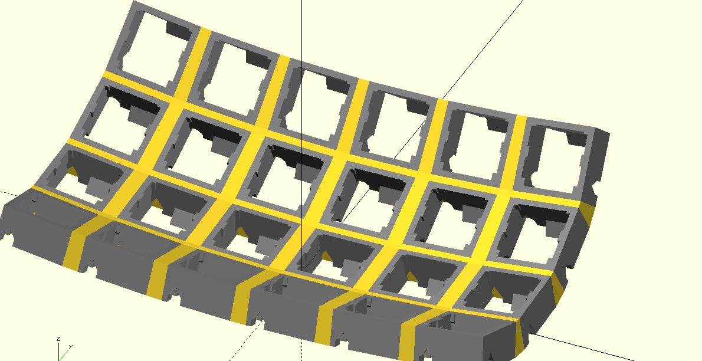

# Curled Keyboard



A keyboard that can

- curl along each finger, and
- curl between fingers

to make keys easier to reach.

Written in solidpython, which gets translated to OpenSCAD:
```bash
uv run horizontal_walls.py # produces `horizontal_walls.stl`
openscad horizontal_walls.stl
```
